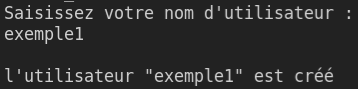
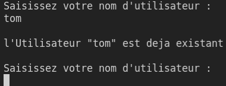

<!-- PROJECT LOGO -->
 

  

  <h3 align="center">README</h3>

  

    Programme Pure-FTP
     
     
     
  

1. Objectif du programme
   
2. Instruction

       

1.
Le programme a pour but d’automatiser l’utilisation du serveur / logiciel « Pure-FTP » grâce à une suite de scripts et de commandes,
  cela en résulte un gain de temps conséquent pour l’utilisateur ainsi qu’une fiabilité supérieure en l’absence d’erreur qui pourrait ralentir votre futur projet.

2.
Lors de l’utilisation du programme différentes saisies vous est demandé,
notamment pour votre nom d’utilisateur*, nom de groupe* 
    ou encore le nom du dossier*.
  

   
   
  
  

  

   
  En cas d’erreur l’instruction vous sera redemandée
    
    
    
   

  

  * Le nom d’utilisateur (user) sert de point de mappage pour vos futurs utilisateurs virtuels, ce nom sera associé au groupe demandé par la suite,
enfin le dossier servira de conteneur ou emplacement pour tous vos utilisateurs virtuels crée par l’intermédiaire de ce programme.

  
